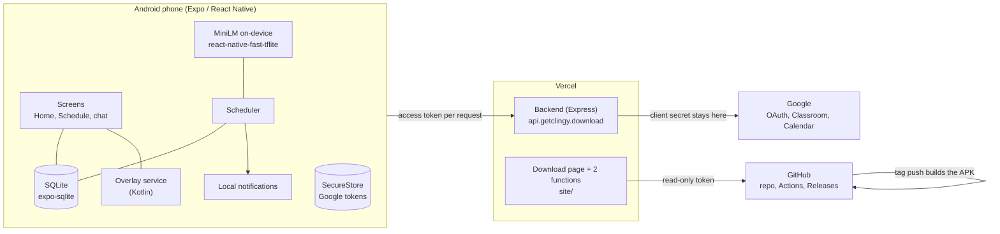
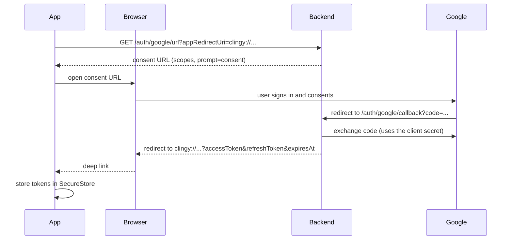
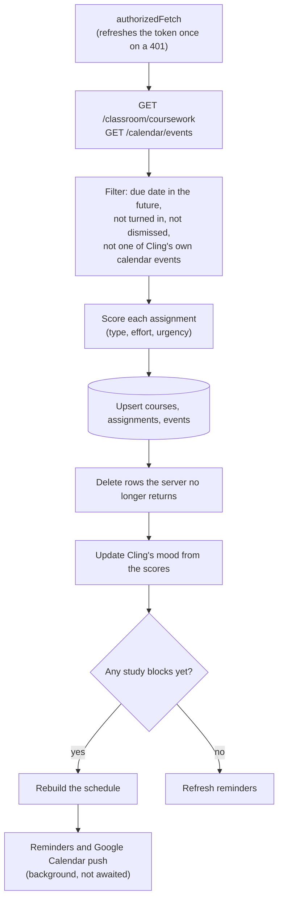
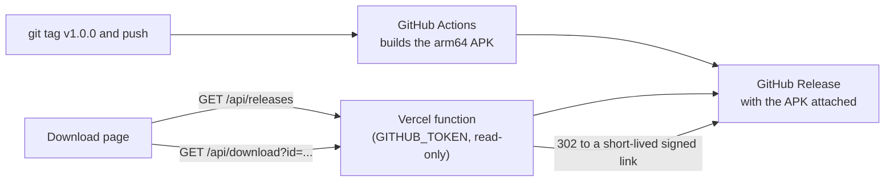

# Architecture

How Clingy is put together, and why. For setup and screenshots see the [README](README.md).

## The pieces

| Part | Where | What it is |
|---|---|---|
| App | `app/` | Expo SDK 57 / React Native 0.86 / Hermes, TypeScript. Android is the target; the floating overlay is Android-only. |
| Backend | `backend/` | A small stateless Express app on Vercel. It holds the Google OAuth client secret and proxies Classroom and Calendar. |
| Download page | `site/` | Static page plus two Vercel functions that read the private repo's releases. Separate Vercel project (root directory `site`). |
| Release pipeline | `.github/workflows/release.yml` | Pushing a `v*` tag builds the arm64 APK and publishes a GitHub Release. |

## Why there is a backend at all

A Google OAuth client secret cannot live inside an app that people install. So the backend does one job: it exchanges the OAuth code for tokens and forwards Classroom and Calendar calls. It stores nothing. Every request carries the user's access token, and the phone keeps all the data. (If the backend were lost, the app would keep working on what is already saved; it just couldn't sync.)

## Signing in

`prompt=consent` makes Google return a refresh token on every sign-in, not just the first. Without it a second sign-in leaves the app unable to refresh after an hour. Tokens travel in the deep-link query string, which is a known trade-off of the custom-scheme redirect.

## Data flow: one sync

`syncNow()` in `src/sync/syncService.ts` is the single pipeline. It runs on launch and sign-in, when the app returns to the foreground (at most once a minute), on pull-to-refresh, and from an OS background task (about hourly, at the OS's discretion).

Screens read **only from SQLite**. That is what makes the app work offline: a failed sync leaves the last good data on screen, and the Home header says when it last synced.

## Prioritising an assignment

Code: `src/priority/`. The goal is two numbers per assignment: *how long will this take* and *how urgent is it*.

1. **Task type.** `taskProfile.ts` matches keywords in the title first (reading, quick task, exam, project, writing, problem set). If nothing matches, the on-device model picks the closest type by meaning (see below), and if nothing is close enough the type is `general`.
2. **Effort.** Minutes come from the type's baseline, scaled by the Classroom point value and the length of the brief, clamped to 20 to 300 and rounded to 5. It deliberately does **not** depend on urgency: a task doesn't get longer because it is due sooner.
3. **Urgency (0 to 1).** `0.5 × due-date closeness + 0.25 × stakes + 0.25 × crunch`, where closeness is `exp(-daysLeft / 5)`, stakes comes from the type and points, and crunch is the effort against about two usable study hours a day. Overdue is 1.
4. **Learning from dismissals.** Each time you dismiss a task of some type, later tasks of that type are scaled down by 10 percent, to a floor of 60 percent.

### The on-device model

A quantized **all-MiniLM-L6-v2** (22.8 MB) turns text into a 384-number vector. `tfliteScorer.ts` compares a task's text with example sentences for each type by cosine similarity (a match needs 0.3 or more). It is *only* a classifier; it does not write text, so the session labels ("Session 2 of 3 · Build") are templates keyed by the guessed type.

- **Tokenizer:** `tokenizer.ts` is a hand-written BERT WordPiece tokenizer (no suitable maintained React Native one exists), fed by `vocab.json`.
- **Input shape:** the community conversion declared its inputs as `[1,1]`, which `react-native-fast-tflite` can't resize, so the shapes in the `.tflite` file were patched to `[1,128]`. If the model is ever re-downloaded, that patch has to be reapplied or inference silently produces garbage.
- **Loading:** `react-native-fast-tflite` can only load web or `file://` addresses, and in a release build a JavaScript-required asset is just a resource name. So the model ships as a native Android asset and `ModelAssetModule.kt` copies it to private storage once per install; the scorer then loads that file.
- **Fallback:** if the model fails to load, classification uses keywords only and everything else still works.

## Planning study time

Code: `src/scheduling/scheduler.ts`. `buildProposedSchedule()` is deterministic and writes nothing; `commitProposedSchedule()` replaces the `schedule_blocks` table and then triggers reminders and the calendar push in the background.

- **Window:** 09:00 to 21:00 local time, the next 14 days, never in the past.
- **Sessions:** each assignment's effort is split into sessions of about an hour (at least 25 minutes), spread evenly from today to a day before the due date (an hour before, if it's due within 36 hours).
- **Fitting:** sessions go into free slots between calendar events and saved busy times, with a 10-minute gap after each and at most 4 hours of study per day. Most urgent assignment first.
- **Pinned blocks:** when you move a block, its exact time is saved as a *pin*. Every rebuild places pins first, counts their minutes toward the assignment, and plans everything else around them.
- **Finished sessions:** marking the first upcoming session done adds its minutes to that assignment's `done_minutes`; the rest re-plans around what's left.
- **Busy times:** "can't make it" and the busy-time picker save unavailable windows that act like calendar events. They persist, so the automatic rebuild after a sync respects them.

Small state that isn't a table lives in `app_meta` as JSON: `unavailable_windows`, `pinned_blocks`, `done_minutes`, `last_synced_at`, `calendar_push`, and `dismissals:<type>`.

## Local data

SQLite (`src/db/schema.ts`, helpers in `queries.ts`):

| Table | Holds |
|---|---|
| `courses`, `assignments`, `events` | What the last sync fetched; assignments carry `urgency_score`, `suggested_minutes` and `task_type` |
| `schedule_blocks` | The current plan; deleting an assignment cascades to its blocks |
| `dismissed_assignments` | Ids you dismissed, so a sync doesn't bring them back |
| `app_meta` | The small key/value state above |
| `pet_state` | Cling's current mood |
| `embeddings` | Cached text vectors |

## Reminders and Google Calendar

- **Reminders** (`src/notifications/reminders.ts`) are local notifications: a day before, two hours before and at each deadline, plus a "Study time" notification at the start of each session. Each reschedule cancels everything and schedules afresh, in parallel and queued so two quick changes can't cancel each other's work.
- **Google Calendar** (`src/sync/calendarPush.ts`, `backend/src/routes/calendar.ts`): after each reschedule the app sends the study blocks to `POST /calendar/study-blocks`. The backend keeps events carrying a private `clingy` marker in step with them (create, rename, delete) and never touches the user's other events. Those events are filtered out when reading the calendar, so a study block can't block itself. It can be switched off in Settings, which removes them.

## Cling

Three faces of one mascot, sharing frames (`assets/cling`, `src/pet/clingFrames.ts`) and one mood.

- **In-app widget** (`PetFloatingFallback`): draggable, snaps to the nearest edge, animated by frame.
- **Floating overlay** (`app/plugins/overlay/`): a Kotlin foreground service that draws the same sprite over other apps with `WindowManager`. It mirrors the in-app animation timings and snap behaviour, hides itself while the app is open, and has a circular ✕ to drag it onto to dismiss it. The JavaScript side talks to it through the `ClingOverlay` native module (`overlayBridge.ts`).
- **Chat panel** (`ClingPanel`, `clingConversation.ts`): a scripted conversation tree with tap-only replies. Replies can trigger real work (list tasks, plan study time, ask for busy time).

**Mood** (`moodAggregation.ts`) is derived from the aggregate urgency of upcoming work and saved in `pet_state`; it picks Cling's animation, including the "!" reminder state.

The native pieces are added to the generated Android project by a local Expo config plugin, `app/plugins/overlay/index.js`: it copies the Kotlin sources, the sprite drawables and the model asset, declares the service and permissions in the manifest, and registers the packages. `android/` itself is generated by `npx expo prebuild` and is not committed.

## Offline behaviour

| Works with no connection | Needs a connection |
|---|---|
| Every screen (they read SQLite) | Signing in |
| Scoring, planning, moving and finishing sessions | Syncing Classroom and Calendar |
| Reminders and the Cling overlay and chat | Refreshing an expired token |
| Staying signed in (tokens are in SecureStore) | Pushing study blocks to Google Calendar |

## Download page and releases

The repository is private, so a public page can't read its releases directly. `site/api/releases.js` lists them using a read-only token that only the Vercel function holds, and `site/api/download.js` redirects to GitHub's short-lived signed download link, so the APK itself never passes through Vercel. The page is plain HTML with no build step.

## Build and deploy

| Thing | How |
|---|---|
| App, development | `npx expo prebuild --platform android`, then `./gradlew installDebug` (needs JDK 21), then `npx expo start --dev-client` |
| App, release | Push a `v*` tag, or run `./gradlew assembleRelease -PreactNativeArchitectures=arm64-v8a` locally |
| Backend | Vercel project with root directory `backend`; deploys on every push to `main` |
| Download page | Vercel project with root directory `site`; env var `GITHUB_TOKEN` |

The release APK is signed with the standard debug key from the Expo template, which is fine for sideloading but means a proper signing key is needed before distributing updates widely.

## Known limitations

- Android only (the overlay and the build assume it).
- Google's consent screen must list a user as a test user, or the app must be verified, before other people can sign in.
- Classroom's point value is used when the course provides it; otherwise effort comes from the task type alone.
- Task-type detection is keyword-first, so an oddly worded title (for example an exam-results upload) can be mistyped.
- Sign-in tokens pass through a deep link, and the APK uses the debug signing key.
- No automated tests; the scheduler was exercised with throwaway scripts against real data.
