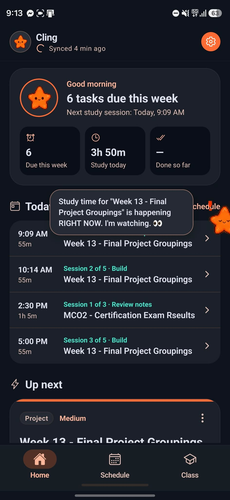
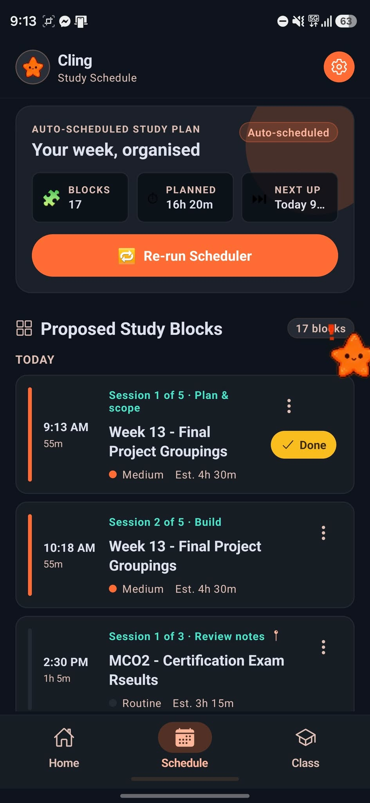
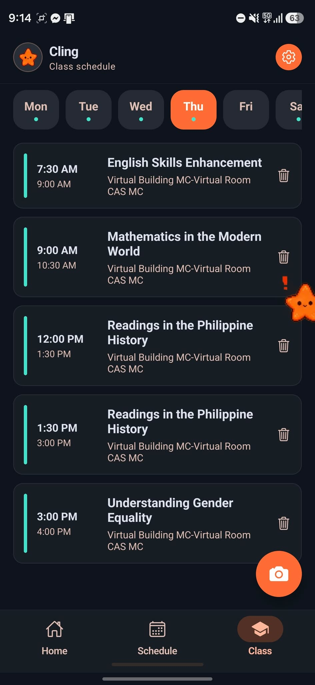
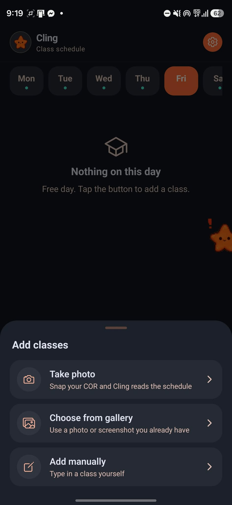
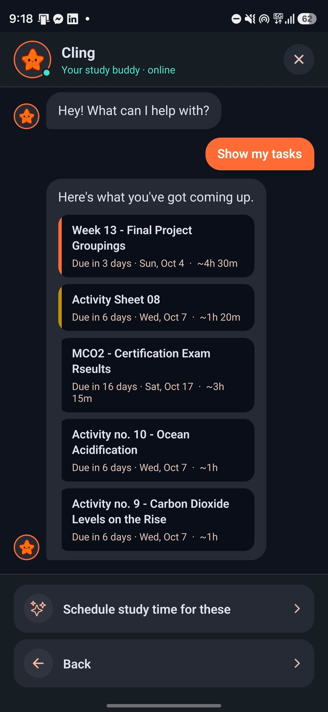

<p align="center">
  
</p>

<h1 align="center">Clingy</h1>

<p align="center">
  Your Google Classroom deadlines, turned into a study plan.<br>
  An Android app that works offline, with a small star called <b>Cling</b> that nudges you.
</p>

<table align="center">
  <tr>
    <td align="center"><br><sub><b>Home</b></sub></td>
    <td align="center"><br><sub><b>Schedule</b></sub></td>
    <td align="center"><br><sub><b>Classes</b></sub></td>
    <td align="center"><br><sub><b>Scan your COR</b></sub></td>
    <td align="center"><br><sub><b>Chat</b></sub></td>
  </tr>
</table>

## What it does

- **Reads your Classroom and Calendar.** Sign in with Google and your assignments and events come in.
- **Decides what's urgent.** Each assignment is scored on its due date, what's riding on it and how much work it needs. A small language model running on the phone helps tell an exam from a worksheet.
- **Plans your study time.** Work is split into sessions of about an hour and fitted around your calendar. Drag a session to a new time and the rest of the plan rearranges itself. Say you're busy and it plans around that. Mark a session done and the plan shrinks.
- **Knows your classes.** Add them by hand or snap a photo of your Certificate of Registration and Cling reads the schedule for you (you check it before it saves). Study sessions are never planned over class time, and in the arrange view classes show up and can't be dropped on.
- **Keeps your Google Calendar in step.** Study sessions and your classes can appear on your calendar too (switchable in Settings).
- **Reminds you.** A day before, two hours before and at each deadline, plus a nudge when a session starts.
- **Works offline.** Everything is stored on the phone; it only goes online to sign in and sync.
- **Cling.** A star that floats over your other apps (drag it to the ✕ to send it away), plus a chat where you can ask what's next or what classes you have. Now and then it pops up with a speech bubble: a class about to start, a session, a deadline, or a reminder to sleep when an exam is close. You can turn that off in Settings.

How all of that fits together is in [ARCHITECTURE.md](ARCHITECTURE.md).

## Get it

Releases are published as GitHub Releases and on the project's download page (`site/`). The APK is for 64-bit Android phones; open it and allow installs from the source when Android asks.

Google only lets listed test users sign in until the app's consent screen is verified, so add anyone who needs to sign in as a test user in Google Cloud Console.

## Run it from source

You need Node 22, JDK 21 (newer JDKs trip the Android build), the Android SDK, and an Android phone with USB debugging.

**1. Backend** (a small Express app; see [why it exists](ARCHITECTURE.md#why-there-is-a-backend-at-all))

```bash
cd backend
npm install
cp .env.example .env     # add your Google OAuth client id and secret, and GEMINI_API_KEY
npm run dev              # http://localhost:4000
```

The Google OAuth client needs `http://localhost:4000/auth/google/callback` (or your deployed address) as an authorized redirect URI, and the Classroom and Calendar APIs enabled. Reading a COR photo needs a Gemini API key from [Google AI Studio](https://aistudio.google.com/); it lives only in `backend/.env` (never in the app or the repo).

**2. App**

```bash
cd app
npm install
cp .env.example .env     # point EXPO_PUBLIC_BACKEND_URL at your backend
npx expo prebuild --platform android
cd android && ./gradlew installDebug && cd ..
npx expo start --dev-client
```

Android's `adb reverse tcp:8081 tcp:8081` lets the phone reach the dev server over USB; a debug build shows a blank screen when that server isn't running. Expo reads `app/.env.local` before `app/.env`, so a backend address in `.env.local` overrides the one in `.env`. `android/` is generated, not committed; rerun `prebuild` after changing a native module or the plugin in `app/plugins/overlay`.

**3. Checks**

```bash
cd app && npx tsc --noEmit && npx expo lint
cd ../backend && npx tsc --noEmit
```

## Project layout

```
app/                     Expo / React Native app
  src/screens/           Home, Schedule, Class, chat, login, drag-to-arrange
  src/classes/           class timetable helpers, day-pattern parser, COR scan client
  src/priority/          task type, effort and urgency; the on-device model
  src/scheduling/        the study-session planner
  src/sync/              Classroom/Calendar sync, background sync, calendar push
  src/db/                SQLite schema and queries
  src/pet/               Cling: sprite, mood, chat script, nudges, overlay bridge
  plugins/overlay/       Expo config plugin + Kotlin: floating Cling, model asset
backend/                 Express: Google OAuth, Classroom and Calendar proxy, COR reader (Gemini)
site/                    Download page and two Vercel functions (releases, download)
.github/workflows/       Builds and publishes the APK when a v* tag is pushed
```

## Deploying

- **Backend:** a Vercel project with root directory `backend`. Set `GOOGLE_CLIENT_ID`, `GOOGLE_CLIENT_SECRET` and `GOOGLE_REDIRECT_URI` (your `/auth/google/callback` address), plus `GEMINI_API_KEY` (and optionally `GEMINI_MODEL`, default `gemini-3.1-flash-lite`) for the COR scan.
- **Download page:** a Vercel project with root directory `site`. Set `GITHUB_TOKEN` to a read-only fine-grained token for this repository, because the repository is private.
- **A release:** `git tag v1.1.1 && git push origin v1.1.1`. GitHub Actions builds the APK and attaches it to a new release, and the download page picks it up.

## Notes

- Android only. The floating Cling uses Android's "display over other apps".
- The release APK is signed with the Expo template's debug key, which is fine for sideloading but not for a store listing.
- There are no automated tests yet. `ARCHITECTURE.md` lists the other known limitations.
